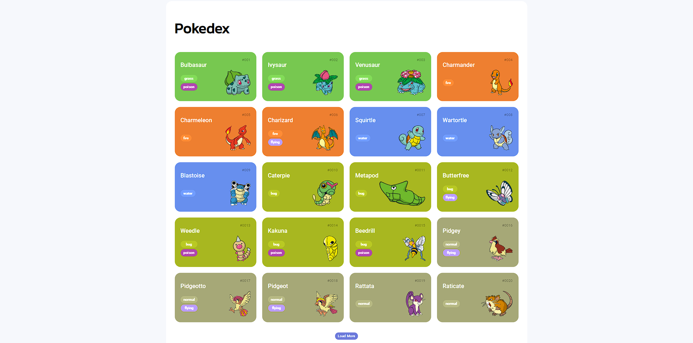

# Pokedex 📟⚡

## Descrição 📃

Este projeto é baseado em uma *Pokedex*, que mostra todos os Pokemons da primeira geração. Foi feito como um desafio do **bootcamp Coding The Future Banco PAN - Desenvolvimento Frontend com Angular, na plataforma da DIO.**

## Conteúdos abordados 🖥️

 Este projeto foi feito seguindo o módulo **Fundamentos de Front-End.**

* **Javascript**
    * Uso da `fetch API` para efetuar as requisições
    * Função `join()` para transformar listas em strings
    * Função `map()` para criar uma lista a partir de outra lista de forma eficiente
* **Requisição HTTP**
    * `URL` como `Endereço` / `Caminho`
    * `Request Methods` que pode ser `POST`, `GET`, `PUT` ou `DELETE`, além de vários outros tipos
    * `Path Params` e `Query Strings`
    * `Request Headers` que é o cabeçalho da requisição
    * `Request Body` que é o corpo de alguns tipos de requisição
    * `Status Code` que indica o que houve com a requisição

## Tecnologias utilizadas 🛠️

## Resultados 🚩
Veja o resultado do site na imagem abaixo:

## Links 🔗

* [🔍 Digital Innovation One](https://www.dio.me/)
* [🔍 Fetch API | MDN](https://developer.mozilla.org/en-US/docs/Web/API/Fetch_API)
* [🔍 Pokeapi](https://pokeapi.co/)
* [🔍 Repositório base do projeto](https://github.com/digitalinnovationone/js-developer-pokedex)